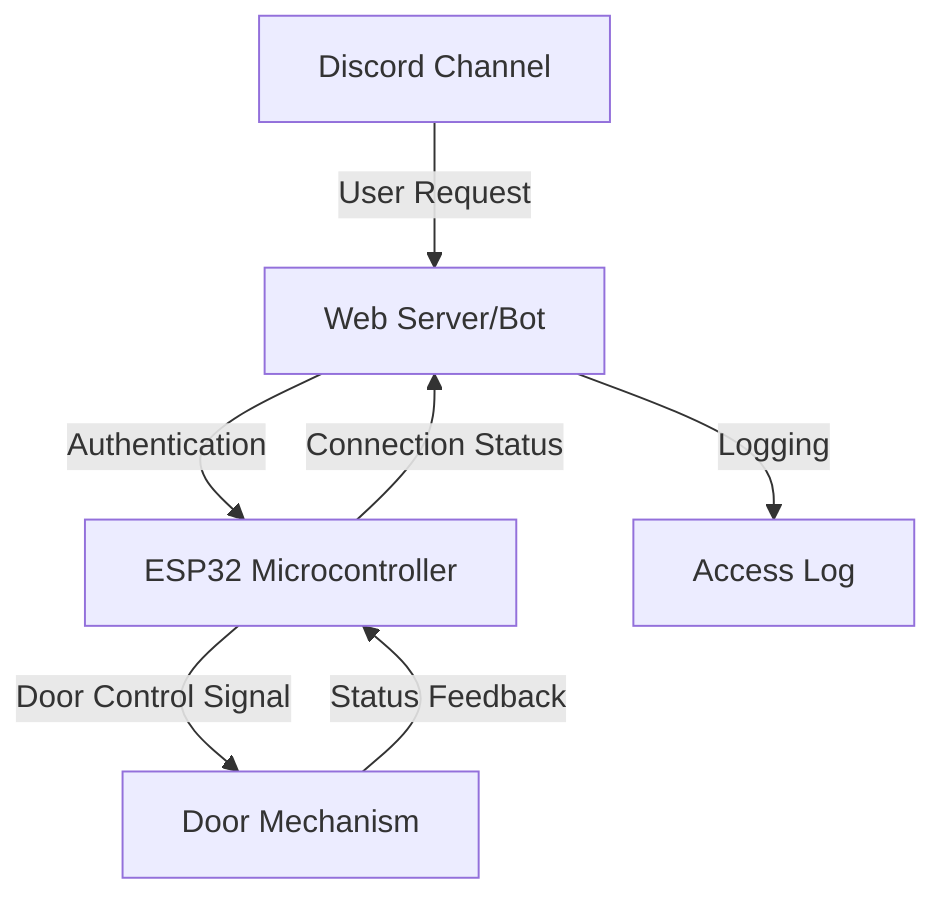

# Commons Hub Door Control System

## Overview
A community-centered solution for secure, remote door access using Discord, ESP32, and web technologies. Open the door of the Commons Hub Brussels via a Discord bot.

## Development Context
Initially prototyped on Linux, finalized on macOS. Cross-platform compatibility is a key design consideration.

## How It Works
The ESP32 is directly connected to the parlophone. It checks an API endpoint every 3 seconds and opens the door when the endpoint returns a 200 status code.

## Quick Start

### Prerequisites
- Python 3.7+
- Node.js 14+
- ESP32 Microcontroller (M5stampC3U)

### Door Access
Join the #door channel on discord.commonshub.brussels (membership required).
- Use `/open` command
- Type "open" in the channel

## High-Level Architecture



## Installation

### Set up the ESP32

1. Rename `credentials.example.py` to `credentials.py`
2. Update WiFi settings (SSID and password)

Install dependencies:
```bash
pip install esptool==4.8.1
pip install adafruit-ampy
```

Flash the ESP32:
```bash
python3 esp32/flash.py /dev/tty.YOUR_PORT
```

#### USB Port Detection
- Linux: Use `ls /dev/ttyUSB*` or `ls /dev/ttyACM*`
- macOS: Use `ls /dev/tty.usbmodem*` or `ls /dev/tty.usbserial*`
- Windows: Check Device Manager for COM port

Replace `/dev/tty.YOUR_PORT` with your specific USB port.

Upload scripts:
```bash
python esp32/install.py /dev/tty.YOUR_PORT
```

### Run Server and Discord Bot

1. Rename `.env.example` to `.env`
2. Configure environment variables:
   - `DISCORD_BOT_TOKEN` (from Discord Developer Portal)
   - `DISCORD_CHANNEL_ID`
   - `SECRET`

3. Ensure Discord bot permissions:
   - Scopes: `applications.commands`, `bot`
   - Permissions: `Manage messages`, `Send messages`

Install and start:
```bash
npm install
npm start
```

## Usage Methods

### Discord Channel
- Type `open`
- Use `/open` command

### API Endpoint
```bash
curl http://localhost:3000/open?secret=YOURSECRET
```

## Additional Endpoints
- View openings log: `http://localhost:3000/log`
- Check device status: `http://localhost:3000/status`

## Detailed Documentation
Explore our comprehensive documentation in the [`docs/`](docs/) directory:
- [System Architecture](docs/README.md)
- [Hardware Setup](docs/hardware-setup.md)
- [Software Installation](docs/software-installation.md)
- [Security Considerations](docs/security.md)

## Contributors
- Nicolas ([@nicolasdb](https://github.com/nicolasdb))
- Xavier ([@xdamman](https://github.com/xdamman))

## License
Refer to the LICENSE file in the project root.

## Platform Compatibility
Developed and tested on Linux and macOS. Windows compatibility may require additional configuration.
